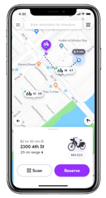
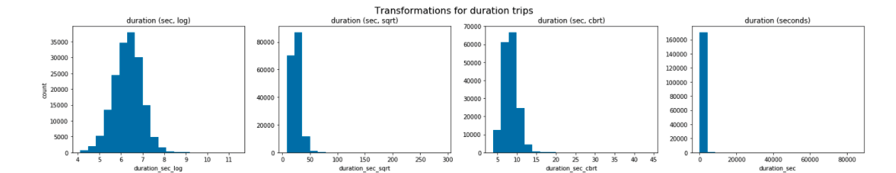
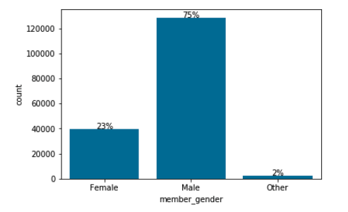
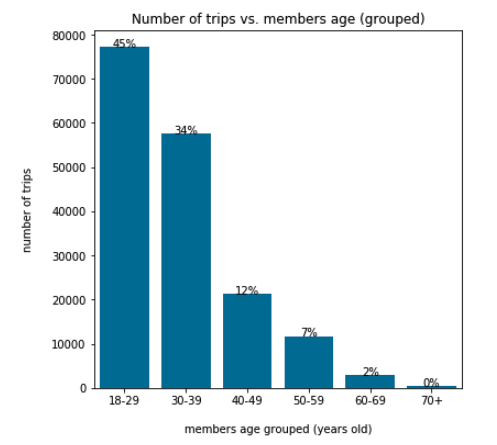
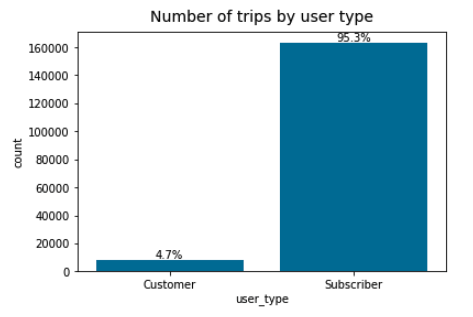
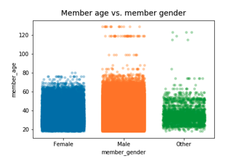
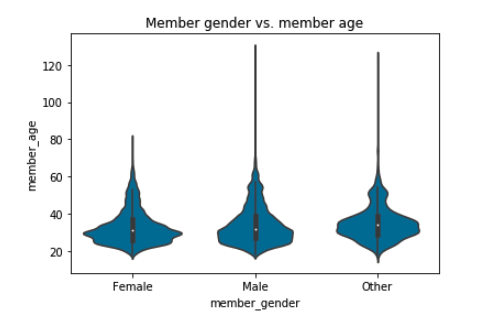
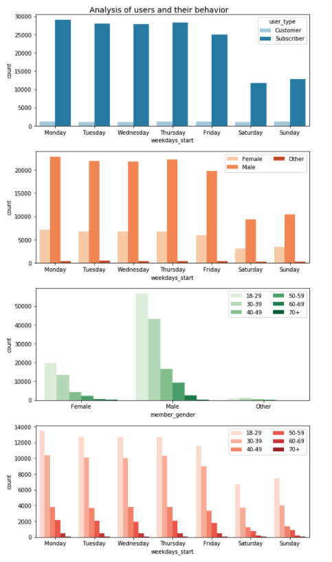
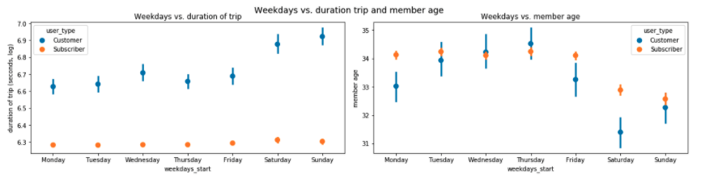

  
## Project Ford GoBike System Data, Dataset Exploration :bike: :iphone: 
### Karina Condeixa  

Fifth project for my Data Analyst Nanodegree by Udacity.  
 
The main objective is to Communicate Data Findings from a dataset from Ford GoBike System Data. I explored data from September of 2019.  

Ford GoBike System Data is hosted at https://www.lyft.com/bikes/bay-wheels/system-data.  

### Table of Contents
- Explanatory Data Analysis: Preliminary Wrangling, univariate, bivariate and multivariate
- Conclusions
- Slides

### Tools
Python 3.6 | Jupyter Nobebook numpy | pandas | matplotlib | seaborn  

### Installation (using Anaconda):
conda install -c anaconda seaborn  

### How I made it

After a first exploratory view, I chose to simplify the dataset according to my targets. So, I dropped columns of the stations (coordinates), and I created columns of age, age group and weekdays. I noticed that the gender female has no outliers in informing the date of birth, hence the age. 

In the exploratory analysis, I explored different types of visualizations for my variables and found
interesting features.  

### Preliminary Wrangling

The **log** was shown the best transformation to deal with *duration_sec*. The oders are too skeewed and hard to interprete.

### Exploratory analysis: univariate exploration

  

- The number of men is really greaten than women. The gender Other is insignificant.
- The bargraph of members age grouped per number of trips highlights the mority of trips per users between 18 and 29 years old.
- The participation of customer travel frequencies is not significant in relation to subscriber trips.

### Outliers

- Comparing the two variable apparently with more outliers with a scatter graph, people said as Male and as others has errors greater than people said as Female.
Interestingly, it seems that only women are careful when entering the birth age and do not make gross mistakes. The genders men and others are said to be older than not just the outlier (60 years old) but also than the life expectancy in the USA (78 years old).
- The violin graph shows that most occurrences of Male and Female are by person between 25 and 30.

### Exploratory analysis: bivariate exploration

- People between 18 and 29 years old are majority on number of trips; then between 30 and 39 and so progressively. That is understandably, younger have more disposition.
- People until 39 use relatively more these bikes than the older ones, considering the number of trips.
- Workdays have higher demand for bikes, while Saturday has the lower demand, considering the number of trips.
- The trip number of subscribers is much higher than customers.
- The trip number of subscribers customers is stable during the weekdays.
- Workdays have higher demand for bikes, while Saturday has the lower demand, considering the number of trips.
- Men make around two times more trips with these bikes than women.
- Workdays have higher demand for bikes, while Saturday has the lower demand, considering the number of trips.
- The pergentage of subscribers are high is both genders.

- There are less longer trips, specially in workdays.
- The duration of trip of youngers is more stable than the olders, these have higher variation. While the behavior of 70+ change on Wednesdays and on Fridays.

### Conclusions

The number of trips at the start of the trips is the same that at the end of trips, considering the top five stations. Therefore, it seems that the users use the bike regularly when leaving and returning. It could be interesting to check if they also go to the same route every trip. 

Regarding the users and trips, men and people between 18 and 39 years old are a majority on trips. Subscribers are also a majority in the trips, they use these bikes regularly on weekdays, mainly for short trips. Saturday has a lower demand for bikes. Strangely, the behavior of 70+ change on Wednesdays and on Fridays, they have a higher variation in the duration of trips. 

I chose the results to put in your explanatory analysis according to the relevance they have to draw the user profile and demands per bike on weekdays. 

I had good feedback given by a Data Analyst in a preliminary version of the exploratory analysis and I have applied some of her suggestions in my project. 

### References
- image: https://www.lyft.com/bikes/bay-wheels/meet-our-bikes
- https://towardsdatascience.com/ways-to-detect-and-remove-the-outliers-404d16608dba
- http://localhost:8888/notebooks/Documents/07-Programming/Udacity/Nanodegree_DataAnalysis/5-
Data_visualization/Project/communicate-data-exampleproject/
Example%20Project/Example_Project_Diamonds_Part1.ipynb
- https://github.com/J2Naughton/FordGoBike/blob/master/FordGoBikePart1.ipynb
- https://github.com/burakgunbatan/UdacityProject---
CommunicateDataFindings/blob/master/Exploration_Ford_GoBike_BurakGunbatan.ipynb
- https://github.com/meet3012/Ford-GoBike-System-Data-Visualization/blob/master/Data-Explorationwith-
Bike-Data.ipynb
- https://github.com/paulfoley/Udacity_Nanodegree-Data_Analyst/blob/master/Ford_GoBike-
Analysis/Ford_GoBike-Analysis.ipynb
- https://www.tutorialspoint.com/seaborn/seaborn_linear_relationships.htm
- Documentations
- Udacity course
- https://stackoverflow.com/questions/34796451/changing-the-marker-size-in-python-seaborn-lmplot
- Life expetance in USA: 78 years and average age in USA: 38 years, in
https://www.google.com/search?client=firefox-bd&
sxsrf=ACYBGNTxM7EZwHhzEi3LOM_4PyjP3ZlixQ%3A1570911206033&ei=5jOiXaHXAcT5sAf
6gLn4DA&q=averge+life+expetance++in+us&oq=averge+life+expetance++in+us&gs_l=psyab.
3..0i13l10.12434.20264..20754...0.2..0.184.1798.5j10......0....1..gwswiz.......
0i71j0i7i10i30j0i13i30j0i8i13i30j0i8i13i10i30.yZj9_rmChPs&ved=0ahUKEwih4qKjxJflAhXEP
OwKHXpADs8Q4dUDCAo&uact=5
- https://www.geeksforgeeks.org/create-a-new-column-in-pandas-dataframe-based-on-the-existingcolumns/
- http://www.datasciencemadesimple.com/drop-delete-rows-conditions-python-pandas/

## License
MIT License

Copyright (c) 2019 Karina Condeixa
